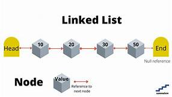
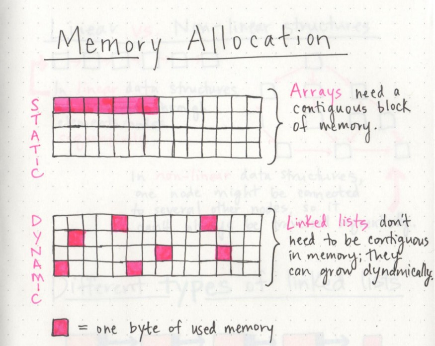
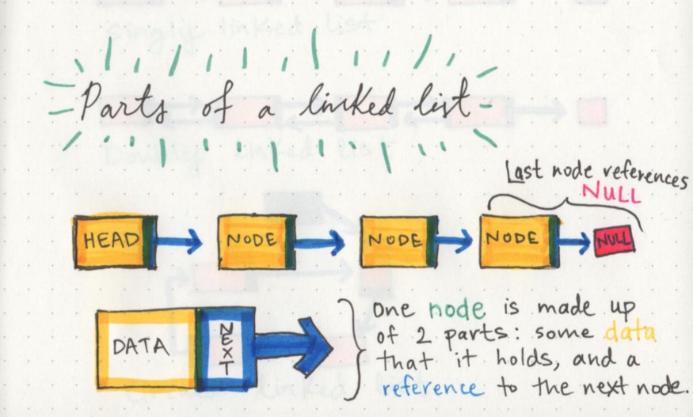

# class-05 Implementation: Linked Lists

## What is a Linked List ?
***a linked list is a linear collection of data elements whose order is not given by their physical placement in memory. Instead, each element points to the next. It is a data structure consisting of a collection of nodes which together represent a sequence.***

## how does it look :

## How many types of linked lists what are they?

***Singly Linked List: It is the most common. Each node has data and a pointer to the next node.***

***Doubly Linked List: We add a pointer to the previous node in a doubly-linked list. ...***

***Circular Linked List: A circular linked list is a variation of a linked list in which the last element is linked to the first element.***

## Memory management :

***The biggest differentiator between arrays and linked lists is the way that they use memory in our machines. Those of us who work with dynamically typed languages like Ruby, JavaScript, or Python don’t have to think about how much memory an array uses when we write our code on a day to day basis because there are several layers of abstraction that end up with us not having to worry about memory allocation at all.***

## Parts of a linked list :

***A linked list can be small or huge, but no matter the size, the parts that make it up are actually fairly simple. A linked list is made up of a series of nodes, which are the elements of the list.***

***The starting point of the list is a reference to the first node, which is referred to as the head. Nearly all linked lists must have a head, because this is effectively the only entry point to the list and all of its elements, and without it, you wouldn’t know where to start! The end of the list isn’t a node, but rather a node that points to null, or an empty value.***

